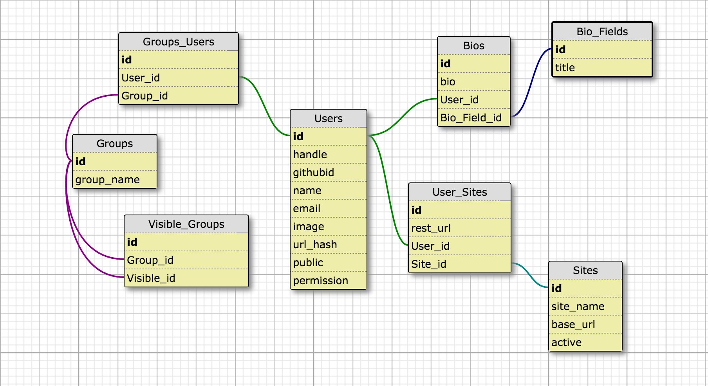

# alumConnect

A React CMS. Currently manages authentication, user profiles, and an admin dashboard with configurable options.

## Contributors:

  [Matthew W. Bresnan](https://github.com/mbresnan1701)

  [Alam Palaniappan](https://github.com/alamuv)

  [Mike Jonas](https://github.com/mikejonas)

  [Drake Wang](https://github.com/yochess/)

## Getting Started

1. Install [MySQL](https://dev.mysql.com/downloads/installer/)
2. Install [Node and NPM](https://nodejs.org/en/)
3. Install webpack globally

    ```
    $ npm install -g webpack
    ```

4. Install dependencies

    ```
    $ npm install
    ```

5. ...

## Database Schema



## Api Endpoints

### Authorization

| Endpoint            | Action | Returns                             | Side Effect                                | Parameters/Req Body                  |
|---------------------|--------|-------------------------------------|--------------------------------------------|--------------------------------------|
|/auth                | GET    | ?                                   | ?                                          | ?                                    |
|/auth/logout         | GET    | ?                                   | ?                                          | ?                                    |
|/auth/sessionreload  | GET    | ?                                   | ?                                          | ?                                    |
|/auth/refreshcookies | GET    | ?                                   | ?                                          | ?                                    |
|/auth/error          | GET    | ?                                   | ?                                          | ?                                    |
|/auth/callback       | GET    | ?                                   | ?                                          | ?                                    |
|/auth/islogged       | GET    | ?                                   | ?                                          | ?                                    |
|/auth/isadmin        | GET    | ?                                   | ?                                          | ?                                    |

### Groups

| Endpoint            | Action | Returns                                    | Side Effect                            | Parameters/Req Body                          |
|---------------------|--------|--------------------------------------------|----------------------------------------|----------------------------------------------|
|/db/groups           | GET    | All groups and their visible groups        | -                                      | -                                            |
|/db/groups           | POST   | Newly created group and its visible groups | -                                      | group_name: new group name                   |
|                     |        |                                            |                                        | visibleGroups: array of visible groups by id |
|/db/groups/group/:id | GET    | A group and its visible groups             | -                                      | id: group id                                 |
|/db/groups/group/:id | POST   | Modified group and its visible groups      | -                                      | id: group id                                 |
|                     |        |                                            |                                        | group_name: modifed group name               |
|                     |        |                                            |                                        | visibleGroups: array of visible groups by id |
|/db/groups/group/:id | DELETE | -                                          | Deletes all associated relational data | id: group id                                 |

### Users

| Endpoint                 | Action | Returns                           | Side Effect                                   | Parameters/Req Body                  |
|--------------------------|--------|-----------------------------------|-----------------------------------------------|--------------------------------------|
|/db/users                 | GET    | Userinfo and groups               | -                                             | -                                    |
|/db/users                 | POST   | -                                 | -                                             | handle: user handle                  |
|                          |        |                                   |                                               | githubid: user github account        |
|                          |        |                                   |                                               | name: user full name                 |
|                          |        |                                   |                                               | email: user email address            |
|                          |        |                                   |                                               | image: user image url                |
|                          |        |                                   |                                               | public: user visibility (0 or 1)     |
|                          |        |                                   |                                               | permission: admin privilege (o or 1) |
|/db/users/user/:id        | GET    | User info, sites, bio, and groups | -                                             | id: user id                          |
|/db/users/user/:id        | POST   | -                                 | -                                             | id: user id                          |
|                          |        |                                   |                                               | handle: user handle                  |
|                          |        |                                   |                                               | githubid: user github account        |
|                          |        |                                   |                                               | name: user full name                 |
|                          |        |                                   |                                               | email: user email address            |
|                          |        |                                   |                                               | url: user url link                   |
|                          |        |                                   |                                               | public: user visibility              |
|                          |        |                                   |                                               | permission: user admin privilege     |
|/db/users/user/:id        | DELETE | -                                 | Deletes all associated relational data        | id: user id                          |
|/db/users/name            | GET    | ?                                 | ?                                             | ?                                    |
|/db/users/user/visibility | POST   | ?                                 | ?                                             | ?                                    |
|/user/uploadimage         | POST   | ?                                 | ?                                             | ?                                    |

### Sites

| Endpoint          | Action | Returns                                      | Side Effect                             | Parameters/Req Body                    |
|-------------------|--------|----------------------------------------------|-----------------------------------------|----------------------------------------|
|/db/sites          | GET    | All sites a user can have                    | -                                       | -                                      |
|/db/sites          | POST   | Newly created site                           | -                                       | site_name: site name                   |
|                   |        |                                              |                                         | base_url: site url                     |
|                   |        |                                              |                                         | hospitalId: Id of appointment hospital |
|/db/sites/site/:id | POST   | Modified site                                |                                         | site_name: site name                   |
|                   |        |                                              |                                         | base_url: site url                     |
|                   |        |                                              |                                         | active: 0 or 1                         |
|/db/sites/site/:id | DELETE | -                                            | Deletes all associated relational data  | id: site id                            |

### Fields

| Endpoint            | Action | Returns                                      | Side Effect                             | Parameters/Req Body                    |
|---------------------|--------|----------------------------------------------|-----------------------------------------|----------------------------------------|
|/db/fields           | GET    | All bio field titles                         | -                                       | -                                      |
|/db/fields           | POST   | Newly created bio field title                | -                                       | title: bio field title                 |
|/db/fields/field/:id | POST   | Modified bio field title                     | -                                       | title: bio field title                 |
|/db/fields/field/:id | DELETE | -                                            | Deletes all associated relational data  | id: bio field title id                 |

## License:

MIT
